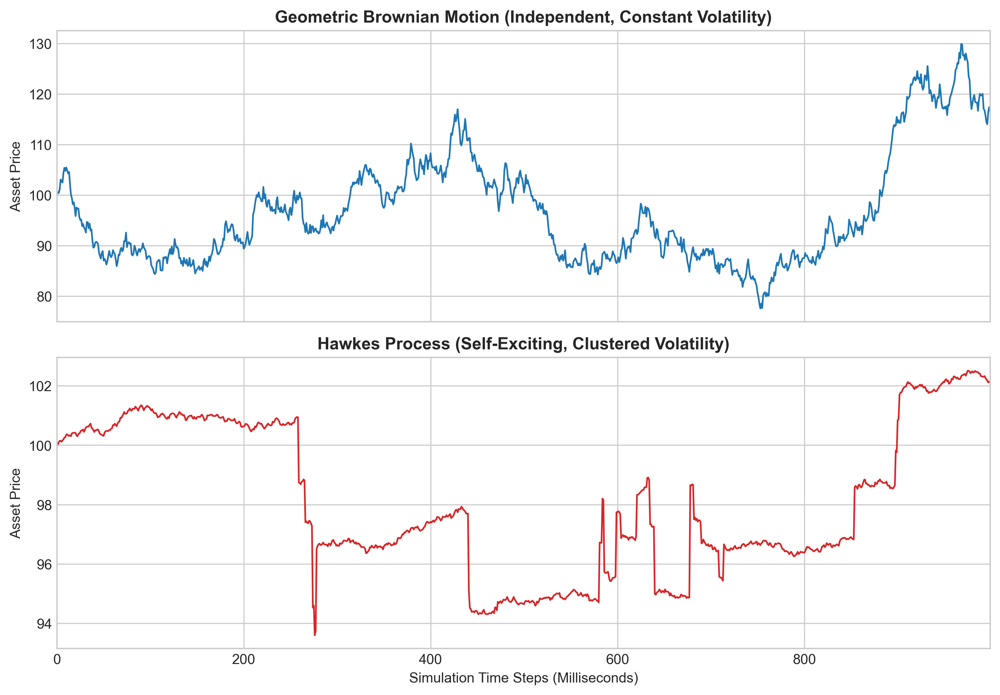
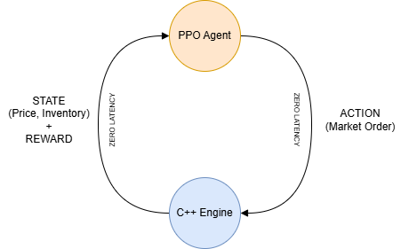
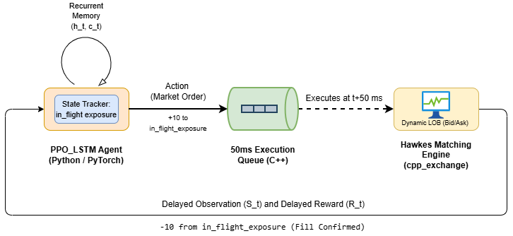
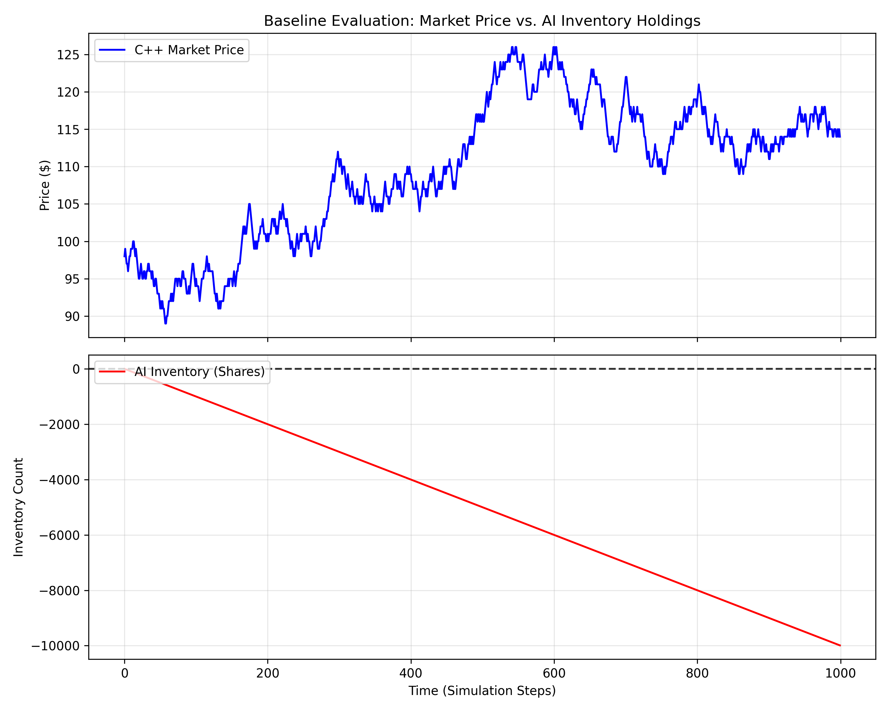
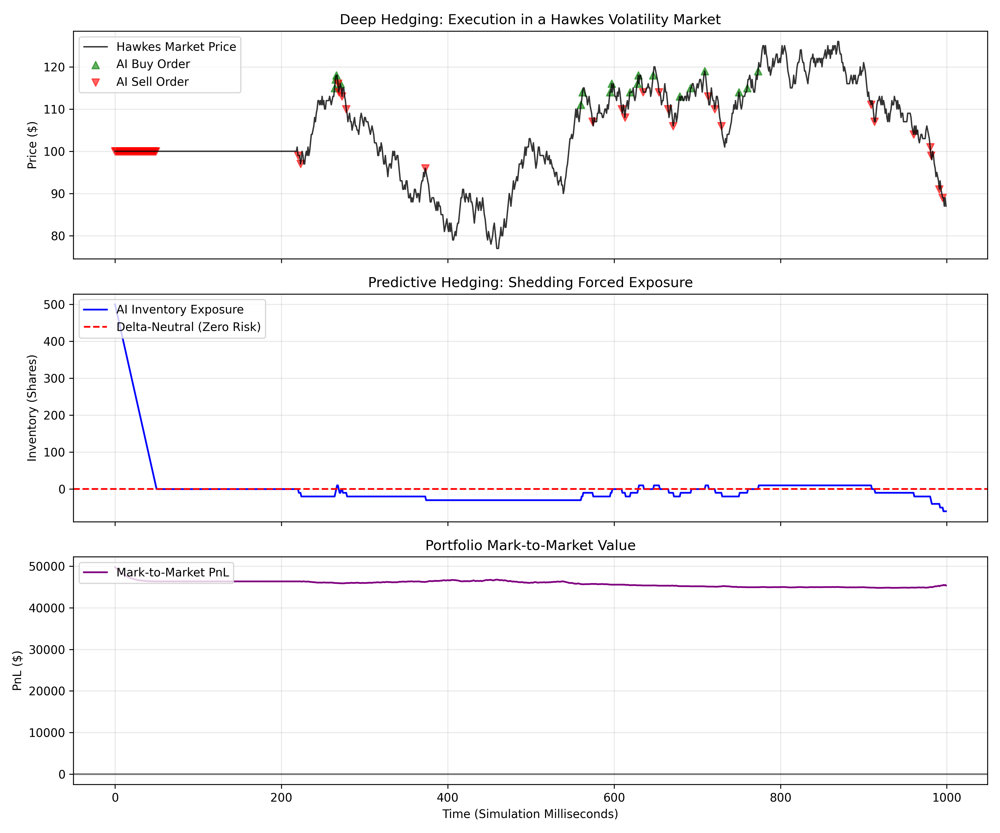
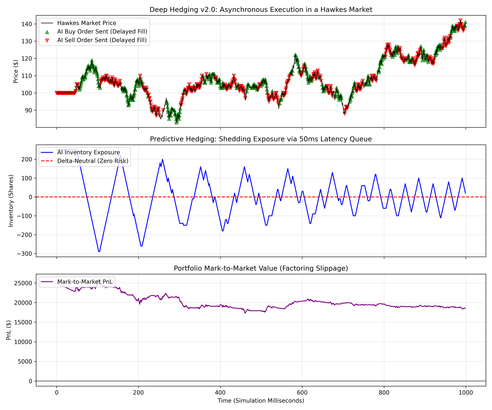

<div align="center">

# Asynchronous Actor-Critic Architectures for Delta-Neutral Hedging

### Optimizing Execution under Hawkes Volatility and Microstructural Latency

**Integrated Dual Degree (B.Tech. + M.Tech.) Thesis**<br>
**Department of Mathematical Sciences · IIT (BHU) Varanasi**<br>
**Anish Dixit · Roll No. 21124056 · 2026**<br>
*Supervisor: Prof. L.P. Singh*

[](https://python.org)
[](https://isocpp.org)
[](https://pytorch.org)
[](https://pybind11.readthedocs.io)

*Bridging the gap between theoretical Markov Decision Processes and the asynchronous, latency-constrained realities of institutional market microstructure.*

</div>

---

## Overview

Standard RL-based hedging literature assumes two things that are false in live markets: that asset prices follow **Geometric Brownian Motion**, and that trade execution is **synchronous and instantaneous**. This thesis dismantles both assumptions.

By engineering a native **C++ matching engine** (exposed to Python via Pybind11) driven by a **self-exciting Hawkes process**, and training a **PPO-LSTM** actor-critic agent with an expanded state space that explicitly tracks pending `in_flight_exposure`, this work proves that:

1. A standard feed-forward PPO agent **catastrophically collapses** when subjected to a 50ms execution latency queue — the *Sawtooth of Death*.
2. A recurrent PPO-LSTM agent equipped with `in_flight_exposure` state successfully acts as a **damped harmonic oscillator**, stabilizing delta-neutral inventory and halting portfolio PnL degradation across the latency void.

---

## Table of Contents

- [Asynchronous Actor-Critic Architectures for Delta-Neutral Hedging](#asynchronous-actor-critic-architectures-for-delta-neutral-hedging)
    - [Optimizing Execution under Hawkes Volatility and Microstructural Latency](#optimizing-execution-under-hawkes-volatility-and-microstructural-latency)
  - [Overview](#overview)
  - [Table of Contents](#table-of-contents)
  - [🎯 Motivation: The Latency Void](#-motivation-the-latency-void)
    - [Why Hawkes, not GBM?](#why-hawkes-not-gbm)
  - [🔬 Key Contributions](#-key-contributions)
  - [🧠 Architecture](#-architecture)
    - [1. C++ Hawkes Matching Engine](#1-c-hawkes-matching-engine)
    - [2. v1.0 — Synchronous "God Mode" (Feed-Forward PPO)](#2-v10--synchronous-god-mode-feed-forward-ppo)
    - [3. v2.0 — Asynchronous POMDP (PPO-LSTM)](#3-v20--asynchronous-pomdp-ppo-lstm)
  - [📊 Key Results](#-key-results)
    - [Pre-Training Baseline: Untrained Agent](#pre-training-baseline-untrained-agent)
    - [v1.0: God Mode Convergence](#v10-god-mode-convergence)
    - [v2.0 Failure: The "Sawtooth of Death"](#v20-failure-the-sawtooth-of-death)
    - [v2.0 Success: Recurrent Stabilization (PPO-LSTM)](#v20-success-recurrent-stabilization-ppo-lstm)
  - [⚙️ Hyperparameters](#️-hyperparameters)
  - [🚀 Installation \& Build](#-installation--build)
    - [Prerequisites](#prerequisites)
    - [Build Instructions](#build-instructions)
  - [💻 Usage](#-usage)
  - [📁 Repository Structure](#-repository-structure)
  - [🔭 Future Scope](#-future-scope)
  - [📖 Citation](#-citation)

---

## 🎯 Motivation: The Latency Void

A delta-neutral hedger must continuously rebalance their portfolio to maintain zero directional exposure (Δ = ∂V/∂S = 0). In a theoretical zero-latency simulation — *"God Mode"* — this is straightforward: the agent observes the market, acts, and receives instantaneous execution. The environment is a well-behaved **Markov Decision Process (MDP)**.

In physical markets, every order must be serialized, transmitted across network infrastructure, and processed by the exchange gateway. This research enforces a rigid **50ms execution queue** in C++. The moment that queue is introduced:

- The agent's observation at decision time `t` no longer reflects the true market state at execution time `t + 50ms`
- The fundamental **Markov property is destroyed**
- The environment strictly becomes a **Partially Observable MDP (POMDP)**: `⟨S, A, P, R, Ω, O, γ⟩`
- A feed-forward network — blind to its own pending orders — enters catastrophic feedback loops

This is the **Latency Void**, and solving it is the central challenge of this thesis.

### Why Hawkes, not GBM?

Classical finance models asset prices via GBM: `dSt = μSt dt + σSt dWt`, where volatility is constant and increments are independent. Real limit order books exhibit **volatility clustering** — a large order triggers cascading executions that self-excite further activity. The Hawkes process models this via a conditional intensity function:

```
λ(t) = μ + Σ α·exp(−β(t − tᵢ))   for all tᵢ < t
```

where `μ` is baseline intensity, `α` is the excitation jump, and `β` is the exponential decay rate. The C++ engine is driven by this equation, forcing the agent to survive micro-flash-crashes and realistic liquidity droughts.


*Top: GBM — smooth, independent increments. Bottom: Hawkes process — self-exciting, clustered volatility shocks that accurately reflect institutional order flow.*

---

## 🔬 Key Contributions

1. **C++ Hawkes Matching Engine** — A native asynchronous limit order book compiled from `src/`, exposed to Python via Pybind11. Models dynamic `T+N` execution delays, Hawkes-driven volatility clustering, and bid-ask spread slippage.

2. **Distributed Rollout Architecture** — A `multiprocessing` vectorization pipeline that bypasses the Python GIL by spawning isolated worker processes each with their own C++ engine instance, saturating multi-core CPUs during PPO rollout collection.

3. **Tolerance Band Reward Topography** — A non-linear utility function establishing a permissible risk corridor (±30 shares) where inventory penalties are zero, then applying a quadratic penalty beyond — balancing spread slippage against inventory risk:

```
Rₜ = ΔPnLₜ − λ · max(0, |Iₜ| − B)²
```

4. **State-Space Expansion for POMDPs** — The key fix: adding `in_flight_exposure (Eₜ)` as a fourth state feature, enabling the LSTM to track pending orders across the 50ms void and act as a damped harmonic oscillator.

---

## 🧠 Architecture

### 1. C++ Hawkes Matching Engine

The core simulation runs entirely in compiled C++ (`src/exchange.cpp`) for microsecond-level throughput. Each `step()` call advances the Hawkes intensity function, fires stochastic market events, drains the **50ms latency queue** — applying execution prices from `t + 50ms`, not the decision price (this is where **slippage is realized**) — and returns `(new_price, list[FillReport])` to Python.

Simulation economics: starting cash `$10,000`, initial price `$100`, spread slippage `$0.50/share`, exchange ticket fee `$1.00/order`. Mark-to-Market value: `MtMₜ = Cashₜ + (Iₜ × Pₜ)`

### 2. v1.0 — Synchronous "God Mode" (Feed-Forward PPO)

The baseline architecture operates as a strict MDP — zero latency, instantaneous execution.



**Topology:** Shared feature extractor (two Dense-64 layers, Layer Normalization + ReLU) splits into an Actor head (Softmax → `{Buy, Sell, Hold}`) and Critic head (Linear → scalar `V(s)`).

**State vector:** `Sₜ = [Pₜ, Iₜ, Tₜ]` — normalized price, normalized inventory, time remaining.

**Training:** 4,000 episodes across the distributed multi-core pipeline. The agent learns to drift freely within the ±30 share Tolerance Band, only crossing the spread when Hawkes volatility forces inventory into the quadratic penalty zone.

### 3. v2.0 — Asynchronous POMDP (PPO-LSTM)

Introducing the 50ms execution queue triggers complete policy collapse in the v1.0 agent. The solution requires both an expanded sensor array and recurrent memory.



**Expanded state vector:** `Sₜ = [Pₜ, Iₜ, Tₜ, Eₜ]` — `Eₜ` is `in_flight_exposure`, the net cumulative value of all pending-but-unfilled orders currently sitting in the 50ms queue.

**Architecture:** The MLP encoder feeds into an **LSTM core** (hidden size 64) before splitting into Actor/Critic heads. LSTM gate operations at each step:

```
fₜ = σ(Wf · [hₜ₋₁, xₜ] + bf)       # Forget gate
iₜ = σ(Wᵢ · [hₜ₋₁, xₜ] + bᵢ)       # Input gate
c̃ₜ = tanh(Wc · [hₜ₋₁, xₜ] + bc)    # Candidate cell
cₜ = fₜ ⊙ cₜ₋₁ + iₜ ⊙ c̃ₜ           # Cell state update
oₜ = σ(Wo · [hₜ₋₁, xₜ] + bo)       # Output gate
hₜ = oₜ ⊙ tanh(cₜ)                # Hidden state output
```

**Training:** Truncated Backpropagation Through Time (BPTT) with sequence horizon `T = 64` steps — sufficient to capture latency dynamics without exploding gradients during Hawkes spikes.

---

## 📊 Key Results

### Pre-Training Baseline: Untrained Agent

An untrained, randomized agent shows the raw difficulty of the problem — inventory drifts monotonically to −10,000 shares with zero corrective behavior.



### v1.0: God Mode Convergence

In the zero-latency environment, the feed-forward PPO agent converges successfully. It sheds a forced +500 share starting exposure in systematic discrete blocks (not a panic dump), holds within ±30 shares, and flatlines Mark-to-Market PnL at ~$46,000 across 1,000ms.



*The agent does not trade continuously — it allows price to drift within the Tolerance Band, only executing when Hawkes volatility forces inventory beyond ±30 shares. Zero-latency means zero unpredictable slippage, so PnL remains flat.*

### v2.0 Failure: The "Sawtooth of Death"

Activating the 50ms queue triggers the feed-forward agent's collapse. It observes a +500 share imbalance and fires a sell. At `t+1`, it observes the **exact same** +500 imbalance (order is trapped in queue) and fires again. The queue clears, inventory overshoots violently to −300, and the cycle repeats. PnL bleeds to −$60,000. This feedback loop is a direct consequence of the broken Markov property in a memoryless network.

### v2.0 Success: Recurrent Stabilization (PPO-LSTM)

Equipping the agent with LSTM memory and `in_flight_exposure` state resolves the feedback loop:



The rigid sawtooth pattern is replaced by a **tightening oscillating wave** — the visual signature of a damped harmonic oscillator. The agent fires a calculated burst of orders, then "feathers the brakes," pausing while the queue clears. Inventory volatility dampens from ±300 down to a stable ±100 share band. PnL stabilizes at ~$19,000 — reduced from the frictionless case due to honest slippage accounting, but controlled and non-catastrophic.

> **The core result:** A memoryless agent loses everything. The recurrent agent loses only what microstructural friction demands — and no more. Perfect delta-neutrality is mathematically impossible in a latency-constrained, self-exciting market, but the recurrent POMDP architecture successfully navigates the efficient frontier between inventory risk and microstructural friction.

---

## ⚙️ Hyperparameters

| Parameter | Value |
|-----------|-------|
| Optimizer | Adam |
| Learning Rate (η) | 3 × 10⁻⁴ |
| Discount Factor (γ) | 0.99 |
| PPO Clipping Parameter (ε) | 0.2 |
| Entropy Coefficient | 0.01 |
| Value Loss Coefficient | 0.5 |
| LSTM Hidden State Size | 64 |
| BPTT Sequence Horizon (T) | 64 steps |
| Tolerance Band Boundary (B) | ±30 shares |
| Spread Slippage | $0.50 / share |
| Exchange Ticket Fee | $1.00 / order |
| Starting Cash | $10,000 |
| Starting Inventory (training) | U(−500, 500) |
| Training Episodes | 4,000 |

---

## 🚀 Installation & Build

### Prerequisites

- C++17 compatible compiler (GCC ≥ 9 or Clang ≥ 10)
- CMake ≥ 3.14
- Python 3.8+

### Build Instructions

**1. Clone the repository**
```bash
git clone https://github.com/yourusername/async-deep-hedging.git
cd async-deep-hedging
```

**2. Set up the virtual environment**
```bash
python -m venv venv
source venv/bin/activate       # Linux / macOS
# venv\Scripts\activate        # Windows
pip install -r requirements.txt
```

**3. Compile the C++ matching engine**
```bash
cd build
cmake ..
make -j$(nproc)
```

The Pybind11 module (`cpp_exchange`) compiles from `src/` and is imported directly by the Python training scripts. Verify with `ls build/cpp_exchange*.so` (Linux/macOS) or `cpp_exchange*.pyd` (Windows).

---

## 💻 Usage

**Train the PPO-LSTM agent (asynchronous v2.0):**
```bash
# Ensure venv is activated and you are in the root directory
python python/train_multicore.py
```

**Evaluate a trained checkpoint:**
```bash
python python/test.py --checkpoint checkpoints/ppo_lstm_best.pt
```

**Run the synchronous God Mode baseline (v1.0):**
```bash
python python/train_multicore.py --mode sync
```

---

## 📁 Repository Structure

```
async-deep-hedging/
├── src/                        # C++ matching engine source
│   └── exchange.cpp            # Hawkes LOB + 50ms latency queue (Pybind11)
├── python/                     # Python training & evaluation
│   ├── train_multicore.py                # Distributed PPO / PPO-LSTM training pipeline
│   ├── test.py             # Out-of-sample evaluation & plotting
│   ├── agent.py                # Actor-Critic LSTM architecture (PyTorch)
│   └── environment.py          # Gym-compatible POMDP environment wrapper
├── assets/                     # Result plots and architecture diagrams
├── build/                      # Build output
├── .gitignore
└── README.md
```

---

## 🔭 Future Scope

- **Adversarial Multi-Agent Dynamics** — Introduce competing RL agents into the same LOB to test whether the LSTM can detect and exploit predatory liquidity sweeps.
- **Limit Order Rebate Optimization** — Expand the action space to passive limit orders, transitioning from pure hedger to market maker optimizing rebate capture while managing adverse selection risk.
- **Variable Latency Jitter** — Replace the static 50ms queue with stochastic latency distributions to stress-test LSTM temporal memory under chaotic real-world routing dynamics.

---

## 📖 Citation

```bibtex
@mastersthesis{dixit2026async,
  title      = {Asynchronous Actor-Critic Architectures for Delta-Neutral Hedging:
                Optimizing Execution under Hawkes Volatility and Microstructural Latency},
  author     = {Dixit, Anish},
  school     = {Indian Institute of Technology (Banaras Hindu University), Varanasi},
  year       = {2026},
  type       = {Integrated Dual Degree (B.Tech.+M.Tech.) Thesis},
  department = {Department of Mathematical Sciences}
}
```

---

<div align="center">

*Department of Mathematical Sciences · IIT (BHU) Varanasi · 2026*<br>
*Supervised by Prof. L.P. Singh*

</div>